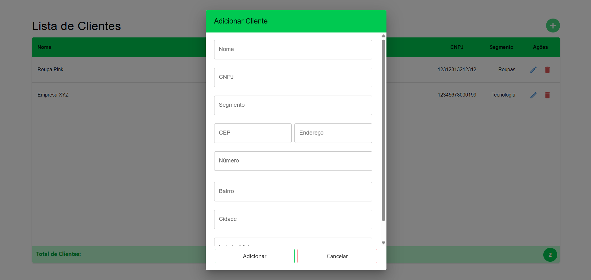
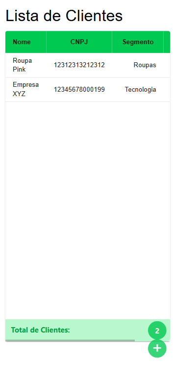

# Gerenciamento de Clientes com React, MUI e Supabase

**Recursos Criados**
***Listar Produtos***
***Adicionar Produtos***
***Editar Produtos***
***Excluir Produtos***
***Contador de Produtos***

Este projeto é uma aplicação web completa para gerenciamento de produtos, construída com 
**React 19**
**TypeScript** Ele se destaca por sua interface moderna e responsiva, usando 
**Material-UI (MUI)** para o design 
**Framer Motion** para animações fluidas. A gestão dos dados é feita através de uma 
**API RESTful** conectada ao 
**Responsive Mobile** Ajuste automático para dispositivos moveis.
**Supabase**.

### 💻 Tecnologias Utilizadas

* **Frontend:**
    **React 19:** Biblioteca JavaScript para a construção da interface do usuário.
    **TypeScript:** Adiciona tipagem estática, garantindo um código mais robusto e livre de erros.
    **Material-UI (MUI):** Um poderoso framework de componentes que segue o Material Design, ideal para criar interfaces elegantes e padronizadas.
    **Framer Motion:** Biblioteca de animação para React, usada para adicionar transições e interações dinâmicas.

* **Backend & Banco de Dados:**
    * **Node.js:** Ambiente de execução para a API RESTful.
    * **Supabase:** Um backend open-source que oferece serviços como banco de dados (PostgreSQL) e autenticação, facilitando o desenvolvimento.

### 🎨 Design e Experiência do Usuário (UX)

A aplicação foi desenvolvida com foco na responsividade e em uma experiência de usuário agradável, adaptando-se perfeitamente a diferentes tamanhos de tela.

#### Versão Desktop

* **Interface Principal**
    * 
* **Modal de Edição/Criação de Produto**
    * 

#### Versão Mobile

* **Layout Adaptável**
    * 

### 🚀 Como Rodar o Projeto

1.  Clone este repositório:
    ```sh
    git clone [URL_DO_SEU_REPOSITORIO]
    ```
2.  Navegue até o diretório do projeto:
    ```sh
    cd nome-do-seu-projeto
    ```
3.  Instale as dependências:
    ```sh
    npm install
    # ou yarn install
    ```
4.  Crie um arquivo `.env` na raiz do projeto e configure suas chaves do Supabase.
5.  Inicie a aplicação:
    ```sh
    npm start
    # ou yarn start
    ```
A aplicação estará disponível em `http://localhost:3000`.
